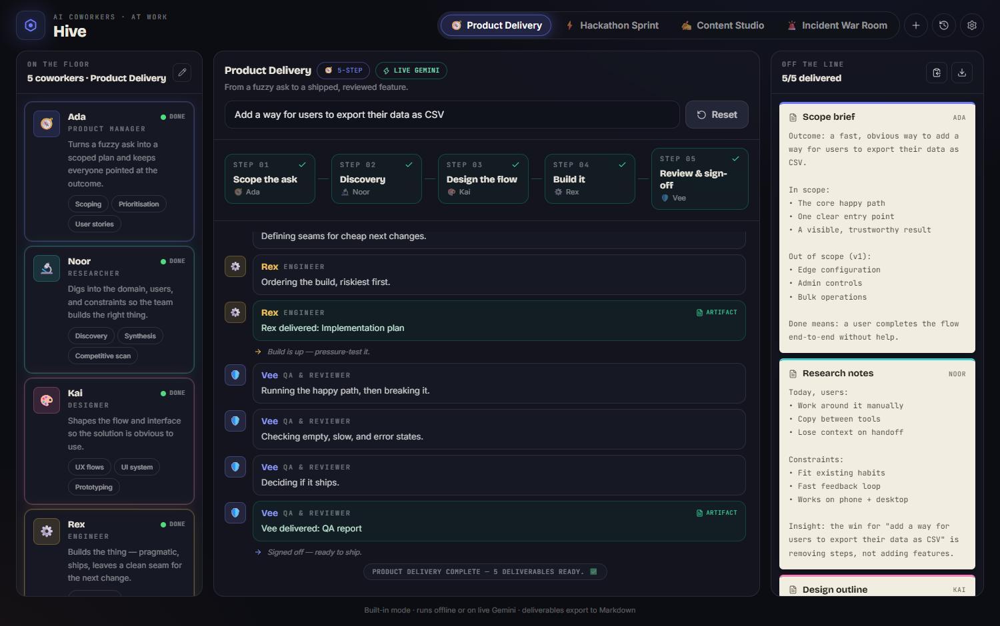
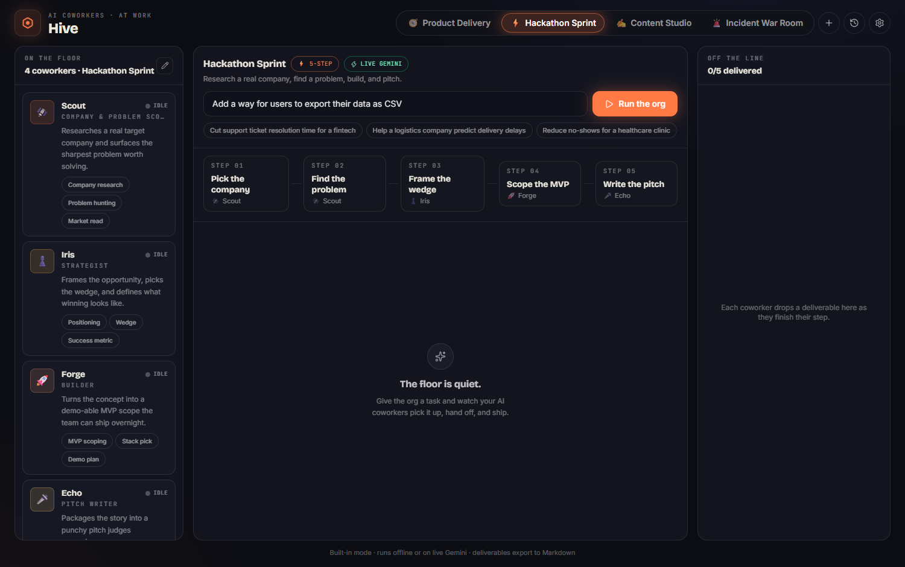
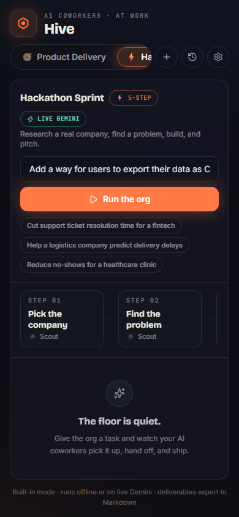

# 🐝 Hive — an organisation of AI coworkers

**Hive is a workspace for a small org of AI coworkers.** Give it a task and a roster of agents picks it up, hands off between each other, and ships real deliverables. Flip the **mode** and the *entire* org reshapes — different coworkers, a different workflow, a different theme — from a normal product team to a hackathon war room and beyond.

**▶ Live: [hive-psi-one.vercel.app](https://hive-psi-one.vercel.app)**



---

## What it does

- **Modes are whole org configurations.** A mode is a roster of agents + a workflow of stages + an accent theme. Switching mode swaps all three at once. Four are built in:
  - 🧭 **Product Delivery** — scope → discover → shape → build → review
  - ⚡ **Hackathon Sprint** — pick a company → find a problem → frame the wedge → scope an MVP → write the pitch
  - 🎬 **Content Studio** · 🚨 **Incident War Room**
- **Build your own org.** The mode editor is full CRUD over agents (name, role, emoji, colour, skills) and stages (title, owner, goal, deliverable). Custom modes persist to `localStorage`.
- **Watch the work happen.** Agents "think" out loud, produce an artifact, and hand off down the relay. Each finished deliverable lands as a warm paper printout on the right.
- **Live web search.** With web access on, coworkers ground their work in current, real data and cite their sources (see below).
- **Export.** Copy or download any run as a clean Markdown brief. Past runs are kept in history.



## Engines — offline, live, and on the web

Hive runs on a pluggable engine with graceful, layered fallback:

1. **Live Gemini** (`gemini-flash-latest`) when a key is available — either your own key (entered in Settings, stored only in your browser) or the server-side proxy on the deployed app.
2. **Live web search** via Gemini's **Google Search grounding** when web access is on. Because grounding is incompatible with forced JSON output, Hive drops structured output for those calls and parses the JSON back out, then surfaces the real sources on each deliverable.
3. **Graceful step-down.** If a grounded call fails (grounding has a stricter quota on the free tier), Hive retries the same stage as *plain* live Gemini — you still get a real AI answer, just without web citations — before ever touching the offline engine.
4. **Deterministic offline engine.** No key, no network, no problem: a built-in simulator produces sensible artifacts for every stage, including custom ones.

The API key never ships to the browser in the deployed app — the `/api/gemini` serverless function holds it server-side.

## Run it locally

```bash
npm install
npm run dev
```

That's it — with no key, Hive runs on the offline engine. To go live:

- **Quickest:** open **Settings** in the app and paste a [Gemini API key](https://aistudio.google.com/apikey). It stays in your browser.
- **Via the proxy:** copy `.env.example` to `.env.local`, set `GEMINI_API_KEY=...` and `VITE_PROXY=1`, then `npm run dev`. The key stays server-side.



## Deploy

Deployed on Vercel. The client is a static Vite build; `api/gemini.ts` is a serverless function. Set two **Production** environment variables:

| Variable | Value | Why |
| --- | --- | --- |
| `GEMINI_API_KEY` | your key | used server-side by `/api/gemini` |
| `VITE_PROXY` | `1` | makes the client route live calls through the proxy |

Then `vercel --prod`. (Vercel does not auto-deploy on push for this project — deploy explicitly.)

## Stack

Vite · React · TypeScript · Tailwind CSS · Zustand · Framer Motion · lucide-react. Fonts: Bricolage Grotesque / Inter / JetBrains Mono. Design language: a dark technical *floor* where the machines work, and warm ivory *paper* where their finished work lands.

## Project shape

```
api/gemini.ts          serverless Gemini proxy (+ Google Search grounding)
src/
  data/modes.ts        built-in org presets
  engine/              pluggable engines: sim (offline), gemini (direct), proxy
  store.ts             zustand store — runs the relay, keeps history
  components/          ModeBar · OrgPanel · Pipeline · Feed · Workspace · Artifacts · editors
  lib/                 storage, markdown export, helpers
```
